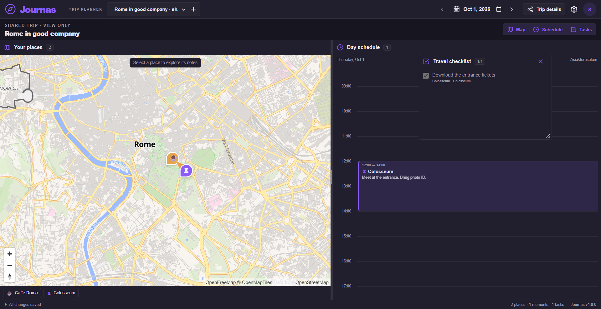

# Journas

Journas is a collaborative travel planner that connects a map, a vertical schedule, and a checklist for each day of a trip. Each traveller keeps their own workspace layout while editing a shared itinerary.

Built with React, TypeScript, Vite, Firebase Authentication, Firestore, MapLibre, OpenFreeMap, and Vercel. Project-specific code is licensed under [MIT](LICENSE); third-party packages and map data retain their own licences and attribution.

Google's sign-in logo comes from its [official branding assets](https://developers.google.com/identity/branding-guidelines) and retains Google's trademark rights.

The production site connects to the Firebase project `journas-trip-planner`. Earlier projects are separate; their accounts and trips are not automatically transferred by changing the app configuration. Legacy local-storage prefixes are read only to migrate pending drafts and layouts safely. Existing share tokens are unchanged; links use the new site hostname.

**Website:** [journas-trip-planner.vercel.app](https://journas-trip-planner.vercel.app). See [verification evidence](docs/verification.md) for the distinction between production checks, emulator checks, and remaining creator actions.



[Open the original 1,920 × 989 PNG captured directly in Chrome](devpost/assets/planner-desktop.png).

The [submission guide](devpost/submission-guide.md) maps every returned Devpost field to prepared copy and the six checked images. The [DemoMotion guide](devpost/demomotion-guide.md) provides exact inputs and a 2:30 recording sequence. Personal reflections, survey answers, eligibility and the final public video remain creator actions.

## What you can plan

- Trip dates up to one year ahead, with a monthly calendar of saved trips.
- Coloured map pins with symbols and notes; gradient lines or arrows between stops.
- Timed visits that inherit their place's title, notes, colour, and symbol until individually overridden, plus independent time blocks.
- Tasks linked to places, visits, both, or neither, with checked/struck-through completion.
- A resizable map/schedule split and movable/resizable floating checklist; saved layouts belong to each person and date.
- View-only share links, explicit authenticated joining when enabled, live planning updates, and conflict handling.
- Local/destination/UTC clock, visible zone, light/dark/system theme, accent, profile, and retention preferences.

Cloud features require your own correctly configured Firebase project; a running frontend alone does not prove authentication or live persistence is configured. Verification evidence belongs in [the build checklist](devpost/checklist.md), not inferred from this feature list.

## Retention and limits

Automatic removal is **enabled by default**, **365 days after the trip ends**. Settings allow disabling it or choosing 30/90/365 days. It removes only that user's membership and personal data, even for the owner. A participant's manual removal is also personal. The owner's explicit **manual** deletion removes the shared trip for everyone, revokes share access, and requires confirmation. Ownership never transfers merely because the owner's account automatically removes a trip. When nobody retains a trip, cleanup purges its remaining data.

Each account can save **100 trips, including joined/shared trips**, with a warning at 80. Both creation and joining are blocked at 100 until that account removes an old trip. Shared planning is stored once, not duplicated per traveller. Opening an untouched day does not create a server record. Only changed day content/layout is stored. The active day receives live subscriptions; personal layout autosaves every five minutes and on navigation.

A detailed Hebrew guide for a new Journas Firebase project is available in [firebase-setup-he.md](docs/firebase-setup-he.md).

## Prerequisites

- Git, Node.js 24, and npm. Vercel also uses Node 24. The `jwks-rsa` dependency uses the compatible CommonJS `jose` 5 build because Vercel's function loader rejects its ESM-only dependency; the locked dependency audit has no known vulnerabilities.
- Firebase Spark project for cloud operation, or Java 21+ for Firestore Emulator testing.
- A free Vercel Hobby account for deployment. Do not activate paid plans, trials that enable billing, Firebase Blaze, Cloud Functions, paid TTL cleanup, or Cloud Scheduler for this project.

## Install and run locally

```powershell
git clone https://github.com/AlonTsur1601/Journas_Trip_Planner.git
Set-Location Journas_Trip_Planner
npm ci
Copy-Item .env.example .env.local
```

Fill `.env.local` using the Firebase setup below. It is local configuration and must stay ignored. Start the API and frontend in **separate terminals in the project directory**:

```powershell
npm run dev:api
```

```powershell
npm run dev
```

Open the frontend URL printed by Vite (normally `http://127.0.0.1:5173`). The Vite proxy forwards `/api` to the local API at `127.0.0.1:3001`; starting Vite alone cannot serve authenticated operations. If you change `API_PORT`, update the development proxy to match.

For a frontend production build:

```powershell
npm run build
npm run preview
```

`preview` serves built frontend files; it does not start Vercel server functions. Use the full development pair or a configured Vercel deployment for cloud workflows.

## Firebase setup — free cloud operation

### 1. Create the project and register the browser app

1. Open [Firebase Console](https://console.firebase.google.com/) and choose **Create a project**. Use a distinct project for Journas and remain on **Spark**. Analytics is optional and unnecessary.
2. Open **Project settings → General → Your apps**, choose the Web icon, and register an app named Journas. Firebase Hosting is not required because Vercel hosts the website.
3. The displayed Firebase Web SDK configuration contains `apiKey`, `authDomain`, `projectId`, and `appId`. Put those into the matching `VITE_FIREBASE_*` variables in `.env.local`.
4. These identify the browser's Firebase project and appear in the compiled website. Firebase Web API keys are not server administrator credentials; access depends on authentication, authorisation, and appropriate key restrictions. See [Firebase API-key guidance](https://firebase.google.com/docs/projects/api-keys).

### 2. Enable authentication

1. In **Build → Authentication → Get started → Sign-in method**, enable **Email/Password** (not passwordless email-link login) and **Google**.
2. For Google, choose a public-facing project name and support email and save. Test with your own Google account.
3. In **Authentication → Settings → Authorized domains**, add the hostname used locally (`localhost` and/or `127.0.0.1`) and the final production hostname. Enter hostnames only, without protocol or paths. Do not assume localhost was added automatically.
4. In **Authentication → Templates**, review verification and reset-password email names/links. Email users must verify their address before cloud planning writes; the API verifies email status. Test registration, verification, sign-in, and reset on the final domain.
5. If changing Google OAuth restrictions in Google Cloud Console, ensure the real deployed origin is allowed. Do not publish OAuth secrets or unrelated account details.

### 3. Create Firestore and deploy access rules

1. In **Build → Firestore Database**, create the default database on the supported free configuration. Choose a suitable region deliberately; do not select a paid-only database variant or upgrade the billing plan.
2. Begin in **production mode**, not permissive test mode. Cloud Storage is not required for the bounded profile-image implementation.
3. Deploy the repository's rules/indexes using the locally installed Firebase CLI:

```powershell
npx firebase login
npx firebase deploy --only firestore:rules,firestore:indexes --project YOUR_FIREBASE_PROJECT_ID
```

4. The rules allow authorised realtime reads while rejecting direct client writes to shared data; mutations go through the checked server API. Never replace these rules with `allow read, write: if true`. Anonymous sharing reads go through the scoped share API, not public Firestore access.

### 4. Configure the private server credentials

1. Open **Project settings → Service accounts → Firebase Admin SDK → Generate new private key**. Download the JSON to a private directory outside the repository, or to the explicitly ignored local file `journas-service-account.json` in the project root. Never stage or upload it.
2. Locally, copy its `project_id`, `client_email`, and `private_key` into the non-`VITE_` variables `FIREBASE_PROJECT_ID`, `FIREBASE_CLIENT_EMAIL`, and `FIREBASE_PRIVATE_KEY` in `.env.local`.
3. Use a quoted key with literal `\n` separators; the server expands them. Alternatively, set `GOOGLE_APPLICATION_CREDENTIALS=./journas-service-account.json` locally (or point it to your private directory), with `FIREBASE_PROJECT_ID` set and the split email/key variables unset. The server uses application-default credentials. Never commit that file or copy it into the public app; Vercel uses the split variables.
4. A service-account key authorises server administration and bypasses Firestore client rules. It is **private**: do not put it in browser variables, source, README examples, screenshots, logs, or chat. If exposed, revoke it and replace it before continuing.
5. Generate a long random `CRON_SECRET` locally and store it as a server-only secret. It protects daily cleanup. Use a secret manager/password tool; do not publish the generated value.

## Run without production credentials: Firebase emulators

Use a separate `.env.local` for emulator mode. Set both project IDs to `demo-journas`, `VITE_FIREBASE_API_KEY=demo-key`, `VITE_FIREBASE_AUTH_DOMAIN=demo-journas.firebaseapp.com`, `VITE_FIREBASE_APP_ID=demo-journas`, `VITE_USE_EMULATORS=true`, `FIRESTORE_EMULATOR_HOST=127.0.0.1:8080`, and `FIREBASE_AUTH_EMULATOR_HOST=127.0.0.1:9099`. Private Admin email/key are not needed when both emulators are configured. Set a local placeholder cron secret for cleanup tests only.

Start three terminals:

```powershell
npm run dev:emulators
```

```powershell
npm run dev:api
```

```powershell
npm run dev
```

Emulator accounts/data are separate from production and can be discarded. Use email accounts for deterministic testing; emulator auth is not proof of real Google OAuth or delivered email. Do not deploy emulator environment variables to Vercel. Java installation and emulator download are required for Firestore.

## Deploy to your Vercel account

1. Open [Vercel](https://vercel.com/), stay on **Hobby**, and import `AlonTsur1601/Journas_Trip_Planner` with the GitHub integration. Project root is the repository root; choose name `journas-trip-planner`, or a close available variant.
2. Use Vite framework preset, install `npm ci`, build `npm run build`, output directory `dist`. Repository `api/` functions provide the backend.
3. Add the four `VITE_FIREBASE_*` values and server-only `FIREBASE_PROJECT_ID`, `FIREBASE_CLIENT_EMAIL`, `FIREBASE_PRIVATE_KEY`, `CRON_SECRET` in **Project → Settings → Environment Variables**. Use the actual project's values, select intended environments, and store private values through Vercel's secret entry interface. No emulator variables or local credential paths belong in Vercel.
4. Deploy. Add the resulting exact production hostname to Firebase Authentication's authorised domains. Redeploy whenever build-time `VITE_` configuration changes; changing server values also requires a new deployment to take effect.
5. Confirm the production homepage, Google sign-in, verified email account, trip write, reload, live two-account edit, and removal semantics on the actual URL. Check logs without printing secrets. A green deployment alone is not acceptance.
6. Inspect **Project → Settings → Cron Jobs**. `vercel.json` schedules `/api/cleanup` daily at `0 2 * * *` (UTC). Vercel sends `Authorization: Bearer CRON_SECRET` when the environment secret is configured; unauthenticated calls must fail. Hobby timing can vary within the scheduled hour, so retention is daily, not an exact-minute promise. See [cron limits](https://vercel.com/docs/cron-jobs/usage-and-pricing).

## Tests and verification

```powershell
npm test
npm run build
npm run test:rules
npm run test:integration
```

The rules suite requires Firestore Emulator/Java and denies foreign access independently of the UI. Domain tests exercise personal versus owner-global deletion, limits, membership, sparse persistence, and conflict handling. Browser acceptance must additionally cover real auth, date/layout restore, map/timeline/tasks, mobile, and two separate accounts. Record actual executed results in the checklist/verification report; do not mark unrun checks as passed. Emulator evidence and production evidence are distinct.

## Free-tier operation and privacy

[Firestore's documented free quota](https://firebase.google.com/docs/firestore/quotas), checked 1 October 2026, includes 1 GiB storage, 50,000 reads/day, 20,000 writes/day, 20,000 deletes/day, and 10 GiB outbound transfer/month. These are **project-wide**, not per-user. Automatic billed TTL deletion is not part of the free allocation; Journas uses its own daily retention handler. Vercel function/bandwidth limits and Firebase Auth email quotas also apply. A 100-trip personal limit does not guarantee unlimited hosting capacity: monitor the console, keep listeners bounded, and show quota failures honestly rather than upgrading billing automatically.

Trip content is shared only with retained participants and holders of a valid scoped share link. Personal layouts/preferences belong to the account. Local pending drafts may persist in the browser until resolved; avoid using a shared device/browser profile for private planning. Canceling/revoking a share grant invalidates future use. Server-only credentials must never appear in the client build. User text is treated as text, not executable markup.

## Project map and submission

| Location | Purpose |
|---|---|
| `src/` | Planner interface, Firebase browser configuration, map, schedule, and preferences |
| `server/` | Authenticated domain operations, persistence, validation, and cleanup |
| `api/` | Vercel API handlers |
| `tests/` | Behaviour and Firestore permissions tests |
| `devpost/scope.md`, `prd.md`, `spec.md` | Approved planning documents required by the event |
| `devpost/checklist.md` | Actual implementation/review progress |
| `devpost/submission-guide.md` | Current exact Devpost fields, assets, links, and remaining personal answers |
| `devpost/demomotion-guide.md` | Exact DemoMotion form inputs and 2:30 video storyboard |

The personal `devpost/learner-profile.md`, `.env.local`, service-account JSON, and credentials are excluded from publication. An ignore rule does not remove a secret already committed: inspect staged changes and history before public pushes.

For the [Build With AI: Basics event](https://learn-ai-basics.devpost.com/), use the installed Devpost Learn skills and public planning artifacts. A short real-product video and public licensed repository are required; site deployment alone is insufficient. [The submission guide](devpost/submission-guide.md) distinguishes prepared drafts from required creator-supplied reflections, eligibility, final media, and actual submission. No public link or completed-learning claim should be invented.
